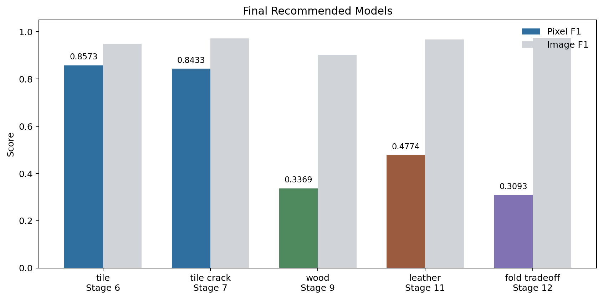
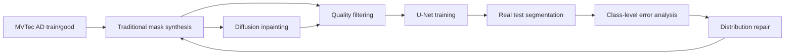

# 基于 Diffusion Inpainting 的工业缺陷图像生成与分割验证

> This project evaluates whether synthetic defect data improves real MVTec AD segmentation, not whether generated images merely look realistic.

## 项目简介

本项目面向工业视觉缺陷样本稀缺问题，构建了一套可复现、可解释的 synthetic defect 数据增强与真实测试集分割验证流程。

核心问题不是：

```text
Diffusion 图片看起来像不像缺陷。
```

而是：

```text
synthetic defect 数据是否能在真实 MVTec AD 测试集上提升分割效果。
```

完整流程：

```text
数据探索
-> traditional 规则伪缺陷生成
-> Diffusion Inpainting 局部缺陷生成
-> 质量筛选
-> U-Net 真实测试集分割评估
-> 类别级误差分析
-> 生成分布专项修复
-> 跨类别泛化验证
```

当前已覆盖三个 MVTec AD 表面类别：

```text
tile
wood
leather
```



## 方法流程



## 最终结论

本项目最终证明：

```text
1. synthetic defect 数据可以提升真实测试集分割效果。
2. 生成数据不是越多越好，类别分布匹配比数量更关键。
3. 跨类别迁移可行，但每个类别仍需要误差分析和生成分布修复。
4. 正常图空 mask negative samples 对 leather 这类易过分割类别非常关键。
```

最终项目定位：

```text
一个可迁移的工业表面缺陷 synthetic data + U-Net 分割验证框架，
核心亮点是可解释的类别级生成修复，而不是单纯生成图片。
```

## 最终推荐结果

| 类别 / 目标 | 推荐阶段 | Pixel F1 | Best Pixel F1 | Image F1 | 关键类别指标 |
| --- | --- | ---: | ---: | ---: | --- |
| tile overall | Stage 6 gray_stroke fixed | 0.8573 | 0.8719 | 0.9492 | gray_stroke Dice = 0.8409 |
| tile crack specialist | Stage 7 crack fixed | 0.8433 | 0.8668 | 0.9711 | crack Dice = 0.7589, Recall = 0.6841 |
| wood overall | Stage 9 scratch fixed | 0.3369 | 0.3815 | 0.9023 | scratch Dice = 0.3405, Recall = 0.4169 |
| leather overall | Stage 11 precision / cut fixed | 0.4774 | 0.5219 | 0.9667 | cut Dice = 0.4064 |
| leather fold tradeoff | Stage 12 fold fixed | 0.3093 | 0.4011 | 0.9735 | fold Dice = 0.4873, Recall = 0.6660 |

说明：

```text
Stage 6 是 tile overall best。
Stage 9 是 wood overall best。
Stage 11 是 leather overall best。
Stage 12 是 fold 召回补强实验，不是 leather overall best。
```

## 关键实验故事

### tile: gray_stroke 修复

Stage 6 expanded combined 暴露出：

```text
gray_stroke Dice = 0.0022
```

通过类别级分布分析修复生成规则后：

```text
Pixel F1 = 0.8573
gray_stroke Dice = 0.8409
```

### tile: crack 专项提升

Stage 7 修复 crack 生成分布后：

```text
crack Dice = 0.7589
crack Recall = 0.6841
Image F1 = 0.9711
```

但 default Pixel F1 小幅低于 Stage 6，因此作为 crack specialist。

### wood: scratch 修复

Stage 8 wood 流程跑通，但：

```text
scratch Dice = 0.0247
scratch Recall = 0.0146
```

修复 scratch 从细小局部线条到大范围纹理扰动后：

```text
scratch Dice = 0.3405
scratch Recall = 0.4169
wood Pixel F1 = 0.3369
```

### leather: good negatives 修复过分割

Stage 10 leather 泛化时：

```text
Pixel Precision = 0.0305
good image_score mean ~= 0.994
```

说明模型对正常 leather 纹理也高响应。Stage 11 加入真实 `train/good` 空 mask negative samples 并修复 cut 后：

```text
Pixel Precision = 0.8752
Pixel F1 = 0.4774
cut Dice = 0.4064
```

### leather: fold tradeoff

Stage 12 修复 fold 后：

```text
fold Dice = 0.4873
fold Recall = 0.6660
```

但：

```text
Pixel F1 = 0.3093
Pixel Precision = 0.2004
```

所以 Stage 12 是类别召回补强和 precision / recall tradeoff 分析，不作为 overall best。

## 文档入口

最终汇总：

- [最终项目总结](docs/final-project-summary.md)
- [面试表达稿](docs/interview-talking-points.md)
- [环境安装记录](docs/environment-setup.md)
- [最终结果 Dashboard](outputs/final_report/final_results_dashboard.md)
- [论文式结果表](outputs/final_report/final_paper_tables.md)
- [诊断证据汇总](outputs/final_report/diagnostic_summary.md)
- [项目卡片](docs/project-card.md)

阶段文档：

- [第 1 阶段：MVTec AD 数据探索与校验](docs/stage-01-data-exploration.md)
- [第 2 阶段：传统规则伪缺陷生成](docs/stage-02-traditional-synthesis.md)
- [第 3 阶段：Diffusion Inpainting 缺陷生成](docs/stage-03-diffusion-generation.md)
- [第 4 阶段：PatchCore 风格无监督异常检测 Baseline](docs/stage-04-patchcore-baseline.md)
- [第 5 阶段：U-Net 监督分割训练与生成数据增强对比](docs/stage-05-unet-segmentation.md)
- [第 6 阶段：扩大生成数据、质量筛选与监督分割再验证](docs/stage-06-expanded-synthesis-and-filtering.md)
- [第 7 阶段：crack 专项改进与最终实验整理](docs/stage-07-crack-improvement-and-final-analysis.md)
- [第 8 阶段：wood 类别泛化验证与复现实验包](docs/stage-08-wood-generalization.md)
- [第 9 阶段：wood scratch 专项修复与跨类别误差分析](docs/stage-09-wood-scratch-fix.md)
- [第 10 阶段：leather 第三类别泛化验证](docs/stage-10-leather-generalization.md)
- [第 11 阶段：leather precision / cut 专项修复](docs/stage-11-leather-precision-cut-fix.md)
- [第 12 阶段：leather fold 专项修复与保守模型召回补强](docs/stage-12-leather-fold-fix.md)
- [第 14 阶段：工程化复现与项目展示升级](docs/stage-14-engineering-reproducibility.md)
- [第 15 阶段：开源级复现规范、测试与配置化升级](docs/stage-15-open-source-health-checks.md)
- [第 16 阶段：最终展示资产与论文式结果可视化](docs/stage-16-final-visuals-and-paper-tables.md)
- [第 17 阶段：诊断证据与消融汇总](docs/stage-17-diagnostic-evidence-and-ablation-summary.md)

## 复现入口

### 1. 准备环境

建议使用独立环境运行：

```powershell
conda activate industrial-defect-diffusion
```

如需重新安装依赖：

```powershell
python -m pip install -r requirements.txt
```

Windows 中文路径下建议开启 UTF-8 输出，避免控制台编码问题：

```powershell
$env:PYTHONUTF8="1"
```

### 2. 配置数据路径

请先下载并解压 MVTec AD，然后把 `DATA_ROOT` 指向数据集根目录。不要把本机绝对路径写进仓库。

PowerShell：

```powershell
$env:DATA_ROOT="<path-to-MVTec_AD>"
```

Bash / macOS / Linux：

```bash
export DATA_ROOT="<path-to-MVTec_AD>"
```

数据目录应类似：

```text
$env:DATA_ROOT/
  tile/
  wood/
  leather/
```

### 3. 快速复现最终汇总

如果只想复现论文式结果表，不需要重新训练，直接收集仓库中已保存的关键 `metrics.json`：

```powershell
python scripts/13_collect_final_results.py
python scripts/14_generate_final_dashboard.py
python scripts/16_generate_final_visuals.py
python scripts/17_collect_diagnostics.py
```

输出：

```text
outputs/final_report/final_metrics_summary.csv
outputs/final_report/final_class_metrics.csv
outputs/final_report/final_experiment_timeline.md
outputs/final_report/final_results_dashboard.md
outputs/final_report/final_paper_tables.md
outputs/final_report/diagnostic_summary.md
outputs/final_report/figures/
```

检查：

```powershell
python scripts/14_reproduction_check.py
python scripts/15_project_health_check.py
python -m py_compile scripts/13_collect_final_results.py scripts/14_reproduction_check.py scripts/14_generate_final_dashboard.py scripts/15_project_health_check.py scripts/16_generate_final_visuals.py scripts/17_collect_diagnostics.py
```

健康检查输出：

```text
outputs/final_report/reproduction_check.md
outputs/final_report/project_health_check.md
```

如需检查完整训练环境和数据集，可先设置 `DATA_ROOT`，再运行严格检查：

```powershell
python scripts/14_reproduction_check.py --data-root "$env:DATA_ROOT" --strict
```

### 4. 重新运行关键最终模型

下面命令用于重新训练每个类别的推荐模型。重新训练会覆盖对应输出目录，运行前请确认已有结果是否需要备份。

说明：

```text
1. 这些命令复现最终推荐模型，不会重新跑全部 13 个阶段。
2. 如需从零生成 synthetic 数据，请按 docs/stage-*.md 中的阶段命令顺序执行。
3. Diffusion 生成需要本地已有模型缓存或可访问 Hugging Face。
4. 训练结果可能因 CUDA / PyTorch / 随机性有小幅波动，验收以接近最终指标为准。
```

tile overall best：Stage 6 gray_stroke fixed

```powershell
python scripts/05_train_unet_segmentation.py `
  --data-root "$env:DATA_ROOT" `
  --category tile `
  --image-size 256 `
  --epochs 30 `
  --batch-size 4 `
  --seed 104 `
  --traditional-summary outputs/gray_stroke_fix/merged/tile/traditional_summary.csv `
  --diffusion-summary outputs/gray_stroke_fix/merged/tile/diffusion_summary.csv `
  --output-dir outputs/training/unet_segmentation_gray_stroke_fix `
  --experiments combined
```

wood overall best：Stage 9 scratch fixed

```powershell
python scripts/05_train_unet_segmentation.py `
  --data-root "$env:DATA_ROOT" `
  --category wood `
  --image-size 256 `
  --epochs 30 `
  --batch-size 4 `
  --seed 404 `
  --traditional-summary outputs/stage9_wood_scratch_fix/quality_filter/wood/accepted_traditional_summary.csv `
  --diffusion-summary outputs/stage9_wood_scratch_fix/quality_filter/wood/accepted_diffusion_summary.csv `
  --output-dir outputs/training/unet_segmentation_stage9_wood_scratch_fix `
  --experiments combined
```

leather overall best：Stage 11 precision / cut fixed

```powershell
python scripts/05_train_unet_segmentation.py `
  --data-root "$env:DATA_ROOT" `
  --category leather `
  --image-size 256 `
  --epochs 30 `
  --batch-size 4 `
  --seed 604 `
  --traditional-summary outputs/stage11_leather_precision_cut_fix/quality_filter/leather/accepted_traditional_summary.csv `
  --diffusion-summary outputs/stage11_leather_precision_cut_fix/quality_filter/leather/accepted_diffusion_summary.csv `
  --output-dir outputs/training/unet_segmentation_stage11_leather_precision_cut_fix `
  --experiments combined `
  --good-negative-samples 100
```

leather fold tradeoff：Stage 12 fold recall analysis

```powershell
python scripts/05_train_unet_segmentation.py `
  --data-root "$env:DATA_ROOT" `
  --category leather `
  --image-size 256 `
  --epochs 30 `
  --batch-size 4 `
  --seed 604 `
  --traditional-summary outputs/stage12_leather_fold_fix/quality_filter/leather/accepted_traditional_summary.csv `
  --diffusion-summary outputs/stage12_leather_fold_fix/quality_filter/leather/accepted_diffusion_summary.csv `
  --output-dir outputs/training/unet_segmentation_stage12_leather_fold_fix `
  --experiments combined `
  --good-negative-samples 200
```

### 5. 验收标准

运行完成后，至少检查：

```text
outputs/training/unet_segmentation_gray_stroke_fix/tile/combined/metrics.json
outputs/training/unet_segmentation_stage9_wood_scratch_fix/wood/combined/metrics.json
outputs/training/unet_segmentation_stage11_leather_precision_cut_fix/leather/combined/metrics.json
outputs/training/unet_segmentation_stage12_leather_fold_fix/leather/combined/metrics.json
outputs/final_report/final_metrics_summary.csv
```

最终推荐指标应接近：

```text
tile Stage 6 Pixel F1 ~= 0.8573
wood Stage 9 Pixel F1 ~= 0.3369
leather Stage 11 Pixel F1 ~= 0.4774
leather Stage 12 fold Dice ~= 0.4873
```

## 主要脚本

```text
scripts/01_explore_dataset.py
scripts/02_generate_traditional_defects.py
scripts/03_generate_diffusion_defects.py
scripts/04_patchcore_baseline.py
scripts/05_train_unet_segmentation.py
scripts/06_filter_synthetic_quality.py
scripts/07_analyze_crack_distribution.py
scripts/08_run_wood_generalization.py
scripts/09_analyze_wood_scratch_distribution.py
scripts/09_prepare_wood_scratch_fix_dataset.py
scripts/10_run_leather_generalization.py
scripts/11_analyze_leather_cut_distribution.py
scripts/11_prepare_leather_cut_fix_dataset.py
scripts/12_analyze_leather_fold_distribution.py
scripts/12_prepare_leather_fold_fix_dataset.py
scripts/13_collect_final_results.py
scripts/14_reproduction_check.py
scripts/14_generate_final_dashboard.py
scripts/15_project_health_check.py
scripts/16_generate_final_visuals.py
scripts/17_collect_diagnostics.py
```

## 项目结构

```text
industrial-defect-diffusion/
  README.md
  AGENTS.md
  requirements.txt
  configs/
  docs/
  scripts/
  src/
  tests/
  outputs/
```

目录职责：

```text
README.md：最终入口和推荐结果
configs/：类别配置和最终实验清单
docs/：阶段文档、最终总结、面试稿
scripts/：可复现实验脚本和阶段入口
src/：共享类别配置、最终实验清单和通用工具
tests/：轻量单元测试
outputs/：实验输出、CSV、metrics、预览图
```

## 维护原则

```text
1. README 只保留长期有效的项目入口和最终结论。
2. 阶段过程写入 docs/stage-*.md。
3. 最终汇总写入 docs/final-project-summary.md。
4. 不提交大量 PNG、模型权重、预测 mask。
5. 提交代码、文档、关键 CSV/JSON 指标。
```
